# TASK MASTER - TASK MANAGEMENT SYSTEM
Task master is a php based system designed for task management collaboration within a team to boost productivity.  

<br />

## Installation

1. Clone the repository to your desired directory:
   ```bash
   git clone https://github.com/ixynGIT/task-management-system.git [YourDirectoryName]
    ```
2. Or directly download it as zip and extract it to your desired directory.
    
3. If you use xampp make sure to put the folder in the `C:\xampp\htdocs\` in order for it to work.

4. Turn on apache and mysql on xampp.

5. Open your browser and input.
    ```bash
    localhost/task_management_system
    ```

<br />

## Log in credentials

 1. **Admin Access:**
    
    Email: ```admin@admin.com```  Password: ```admin123```


2. **Project Manager Access**

    Email: ```plasabas@admin.com```  Password: ```123```


3. **Employee Access**

    Email: ```plasabas@gmail.com```  Password: ```123```


### Screenshots

**Login**
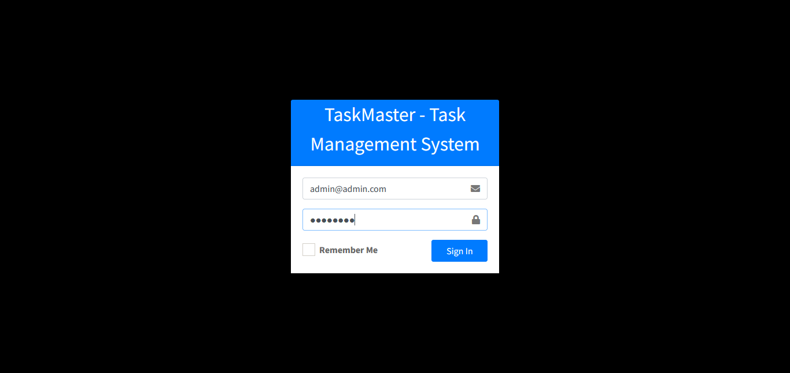

**Dashboard**
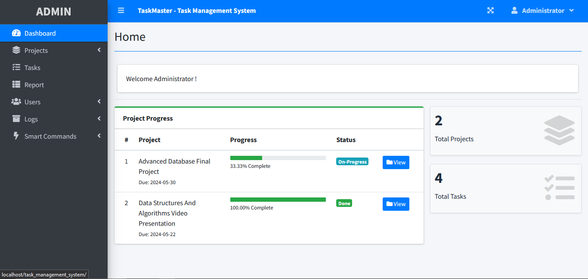

**Projects**
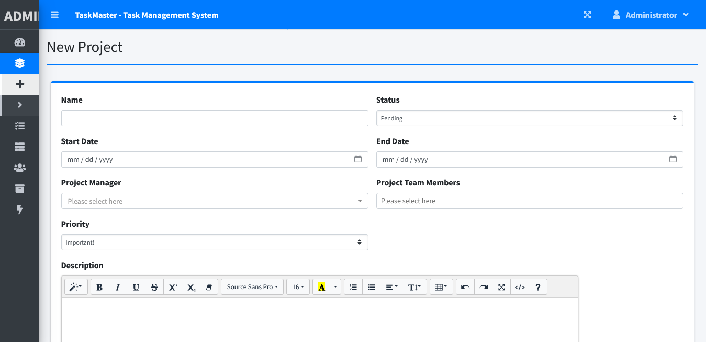
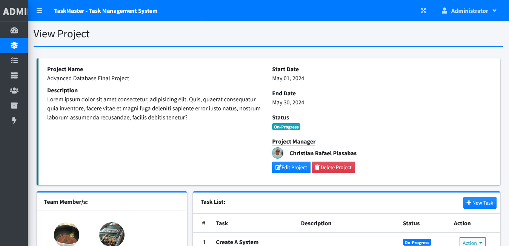
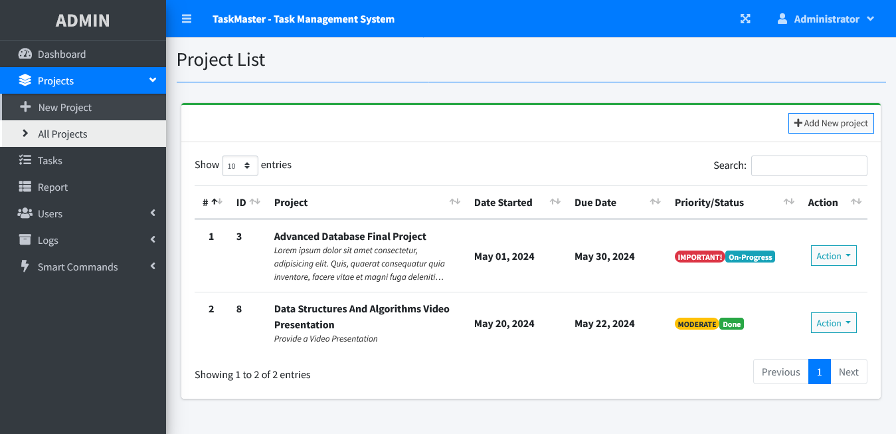
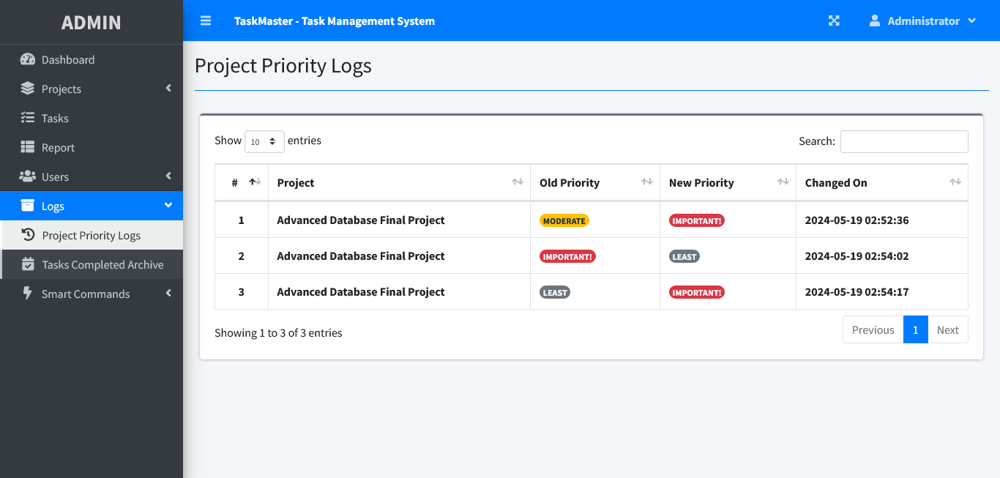


**Tasks**
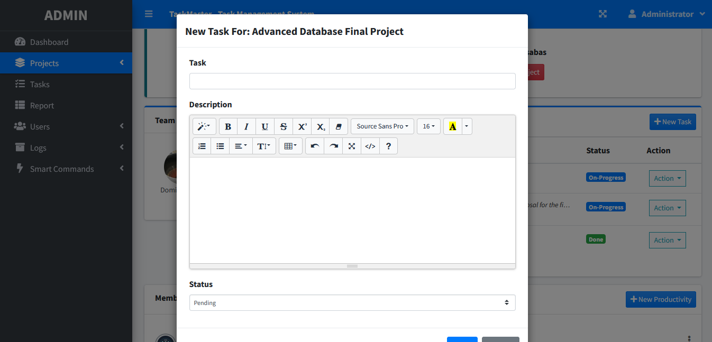
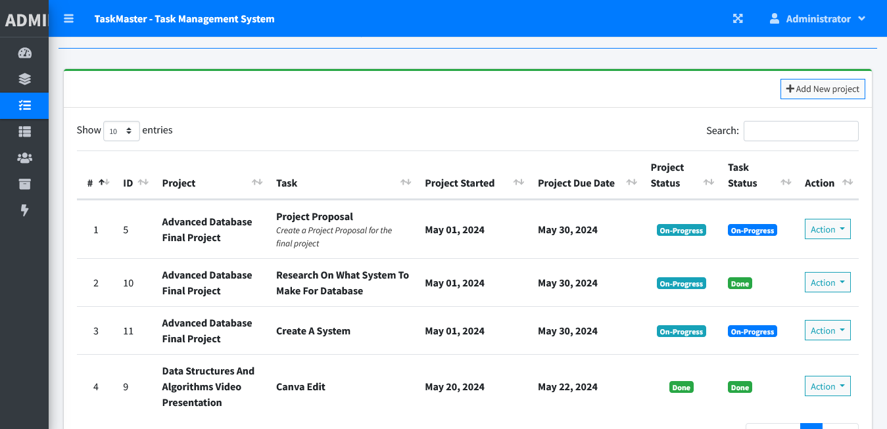
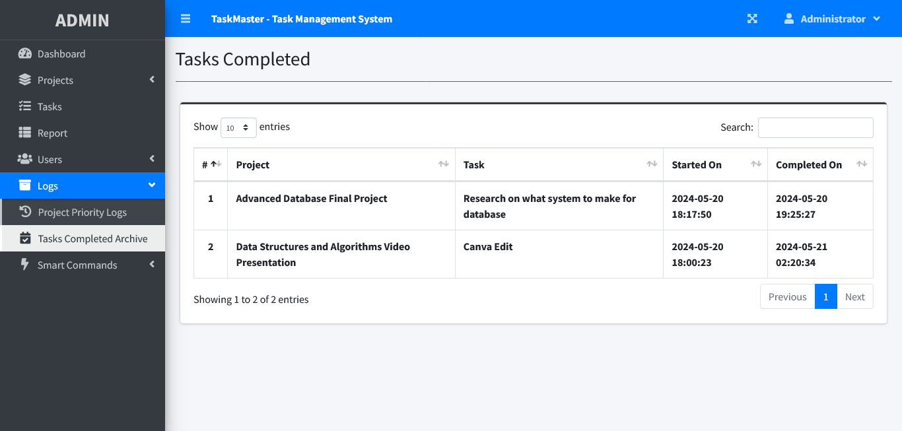

**Report**
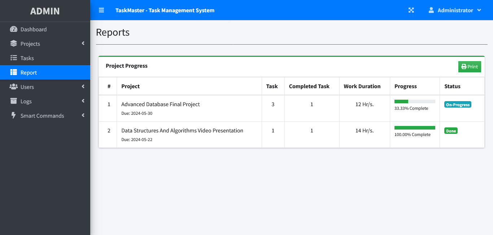

**Users**
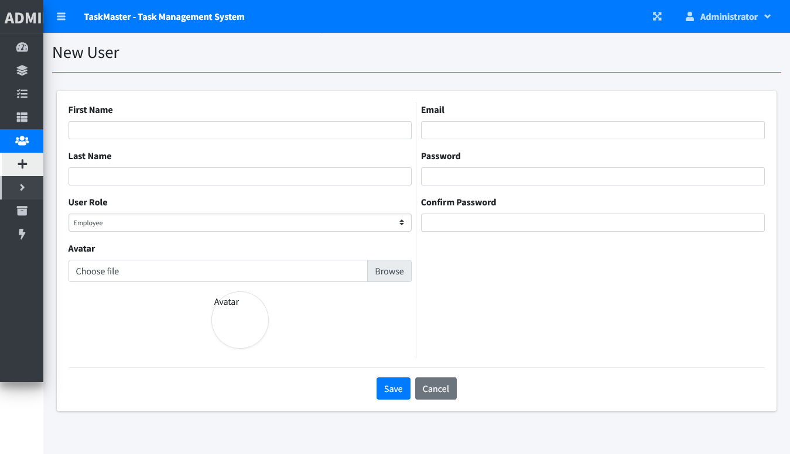


**Smart Commands**
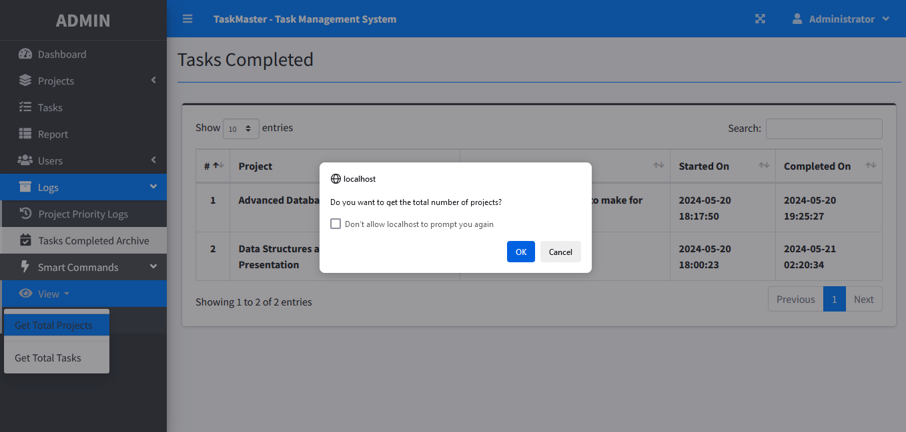
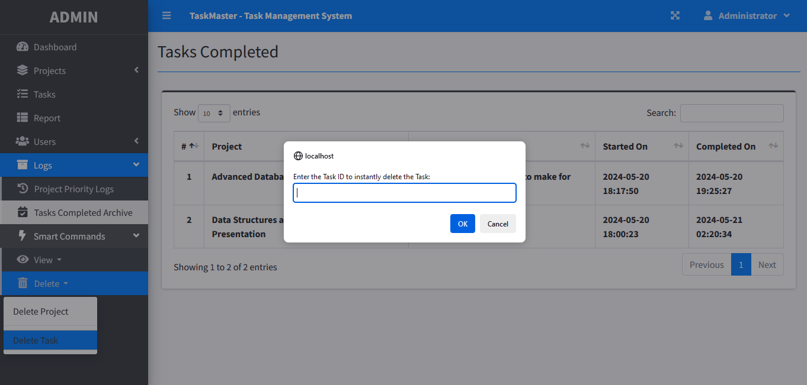


